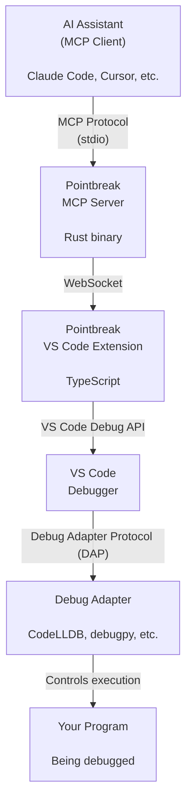

> **Note:** This is a conceptual overview. Implementation details are proprietary.

## Core Concept

Pointbreak is a **bridge** between AI assistants and IDE debuggers. It doesn't implement its own debugger—it uses your IDE's existing debugging infrastructure.

## System Architecture



## Components

### 1. MCP Server (Rust)

**Role:** Protocol translator and command interface

**Responsibilities:**

- Exposes debugging capabilities via MCP protocol
- Translates AI requests into debugging actions
- Manages communication with VS Code extension
- Handles multiple concurrent debugging sessions

**Key Features:**

- Fast, efficient Rust implementation
- Cross-platform (macOS, Linux, Windows)
- Bundled with VS Code extension

### 2. VS Code Extension (TypeScript)

**Role:** Bridge between MCP server and VS Code

**Responsibilities:**

- Controls VS Code's Debug API
- Manages debug sessions
- Syncs breakpoints between AI and IDE UI
- Captures debug console output
- Provides WebSocket server for MCP communication

**Key Features:**

- Uses official VS Code Debug API
- Works with any debug adapter
- Breakpoints visible in IDE gutter
- Real-time state synchronization

### 3. Debug Adapters

**Role:** Language-specific debuggers

**Examples:**

- CodeLLDB (Rust, C, C++)
- debugpy (Python)
- Node Debug (JavaScript/TypeScript)
- Delve (Go)

**Note:** Pointbreak doesn't implement these—it uses whatever you already have installed.

## Data Flow

### Setting a Breakpoint

```
1. AI: "Set breakpoint on line 42"
   ↓
2. MCP Server: Receives setBreakpoint command
   ↓
3. VS Code Extension: Calls VS Code Debug API
   ↓
4. VS Code: Updates breakpoint in UI (red dot appears)
   ↓
5. Debug Adapter: Receives breakpoint when session starts
```

### Inspecting Variables

```
1. AI: "Show me the value of user_input"
   ↓
2. MCP Server: Sends evaluate request
   ↓
3. VS Code Extension: Calls Debug API evaluate()
   ↓
4. Debug Adapter: Evaluates in debugged program context
   ↓
5. Result flows back through the chain
   ↓
6. AI: Displays "user_input = 'Hello'"
```

## Key Design Principles

### 1. Use Native Debuggers

**Why:** Don't reinvent the wheel. VS Code already has excellent debugging infrastructure.

**Benefit:** Works with any language that has a debug adapter.

### 2. Pass-Through Architecture

**Why:** Minimal transformation of commands.

**Benefit:** Predictable behavior, easy to debug.

### 3. UI Synchronization

**Why:** Show what's happening in the IDE.

**Benefit:** Users see breakpoints, can interact manually if needed.

### 4. Language Agnostic

**Why:** Different projects use different languages.

**Benefit:** One tool for all your debugging needs.

## Communication Protocols

### MCP (Model Context Protocol)

**Between:** AI Assistant ↔ MCP Server

**Format:** JSON-RPC

**Transport:** stdio or WebSocket

**Purpose:** Standard protocol for AI-to-tool communication

### VS Code Debug API

**Between:** Extension ↔ VS Code

**Format:** TypeScript API calls

**Purpose:** Native VS Code debugging control

### DAP (Debug Adapter Protocol)

**Between:** VS Code ↔ Debug Adapter

**Format:** JSON-RPC

**Transport:** stdio or network

**Purpose:** Standard debugger protocol

**Note:** Pointbreak doesn't speak DAP directly—VS Code handles this.

## Session Management

### Session Lifecycle

```
1. IDE starts (extension activates)
2. User asks AI to debug
3. MCP server connects to extension
4. AI requests breakpoint set
5. AI requests debug session start
6. Extension launches debugger via VS Code API
7. Program pauses at breakpoint
8. AI inspects state, steps through code
9. Debug session ends
10. Resources cleaned up
```

### Multiple Sessions

Pointbreak supports multiple debug sessions simultaneously:

- Different programming languages
- Multiple programs
- Independent control

## Security Model

### Local-Only Operation

**All communication happens locally:**

- MCP: stdio or localhost WebSocket
- Extension: VS Code API (local)
- No external network access
- No telemetry or tracking

### Trust Model

**Pointbreak trusts:**

- The IDE it runs in
- The debug adapters installed
- The AI assistant using it

**Users should trust:**

- Pointbreak extension (from VS Code Marketplace)
- Their AI assistant (Claude, Cursor, etc.)
- Their debug adapters

## Performance Characteristics

### Low Overhead

- Extension is dormant when not debugging
- MCP server is lightweight
- Minimal impact on debugging performance

### Scalability

- Handles multiple debug sessions
- Efficient WebSocket communication
- Designed for interactive use (not bulk operations)

## Compatibility

### VS Code Versions

Compatible with VS Code 1.74.0+

### Debug Adapters

Any Debug Adapter Protocol (DAP) compliant debugger works.

### AI Assistants

Any MCP-compatible AI assistant works.

Pointbreak works with any MCP client—whether your AI assistant calls tools directly or uses code execution patterns to interact with MCP servers.

## Future Directions

Potential future enhancements (not commitments):

- Replay debugging (record and replay sessions)
- Team collaboration (share debug sessions)
- Smart breakpoints (AI-suggested breakpoint locations)
- Debug analytics (track common issues)

## Questions?

- **How does it work in my language?** - Uses your installed debug adapter
- **Does it modify my code?** - No, only sets breakpoints and inspects
- **Can I use it without AI?** - Yes, but designed for AI interaction
- **Is it open source?** - No, but binaries are free

## More Information

- [Getting Started](getting-started.md)
- [Usage Guide](usage.md)
- [GitHub Discussions](https://github.com/withpointbreak/pointbreak-debug/discussions)
