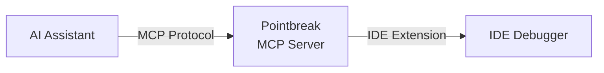

> **Legacy documentation:** This page describes Pointbreak Debug, not the new Pointbreak product.

AI assistants can write code. Now they can debug it too.

Pointbreak gives AI assistants real debugger access, letting them set breakpoints, step through code, and inspect variables in your IDE, all through natural language.

## What Your AI Can Do

Instead of guessing what's wrong or adding print statements everywhere, your AI assistant can:

- 🎯 **Set breakpoints** through natural language ("break on line 42")
- 🔍 **Inspect variables** while your code runs ("show me user_input")
- 🪜 **Step through execution** ("step into this function")
- 🐛 **Find bugs** by actually running and examining your code

## Supported Platforms

- **Languages:** Python, JavaScript, TypeScript, Rust, Go, C, C++, and any language with Debug Adapter Protocol support
- **AI Assistants:** GitHub Copilot, Cursor, Claude Code, Codex, and any MCP-compatible tool
- **IDEs:** VS Code, Cursor, Windsurf, VS Codium, and VS Code-compatible editors

## How It Works



Instead of building a new debugger, Pointbreak uses your IDE's existing debugger. You get all your installed debug adapters, breakpoint UI, and variable inspection—but now controllable through AI.

## Quick Example

```
**User:** "Debug this test and tell me why user_input is empty"

**AI:** Setting breakpoint at line 15... Starting debugger...

_[Breakpoint appears in VS Code]_
_[Debug session starts]_
_[Code pauses at breakpoint]_

Found it! You're reading `user_input` before prompting the user.
The input happens on line 18, but you're using it on line 15.
Move the prompt above the read.
```

## Next Steps

<CardGroup cols={2}>
  <Card title="Installation" icon="download" href="/installation">
    Install Pointbreak for your IDE
  </Card>
  <Card title="Getting Started" icon="rocket" href="/quickstart">
    Your first debugging session
  </Card>
  <Card title="AI Assistants" icon="wand-magic-sparkles" href="/ai-assistants">
    Configure your AI assistant
  </Card>
  <Card
    title="GitHub"
    icon="github"
    href="https://github.com/withpointbreak/pointbreak-debug"
  >
    View on GitHub
  </Card>
</CardGroup>
